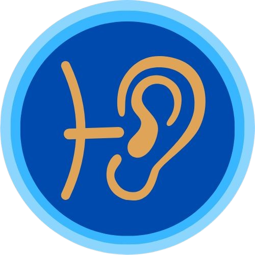
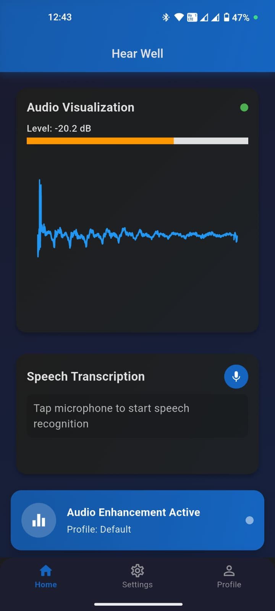
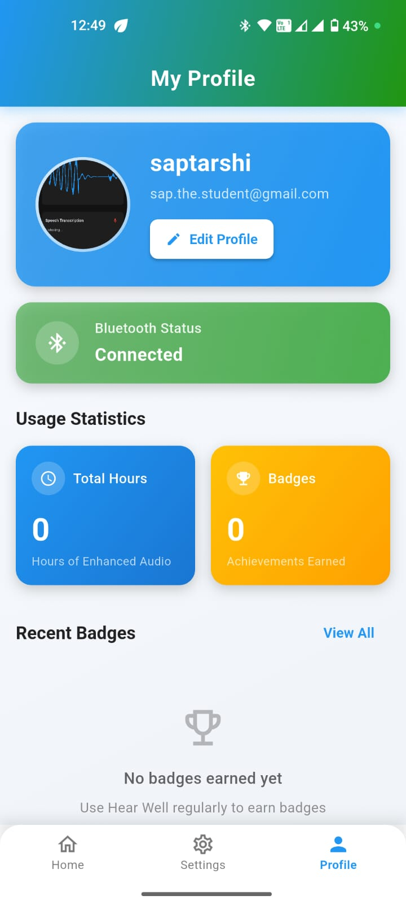
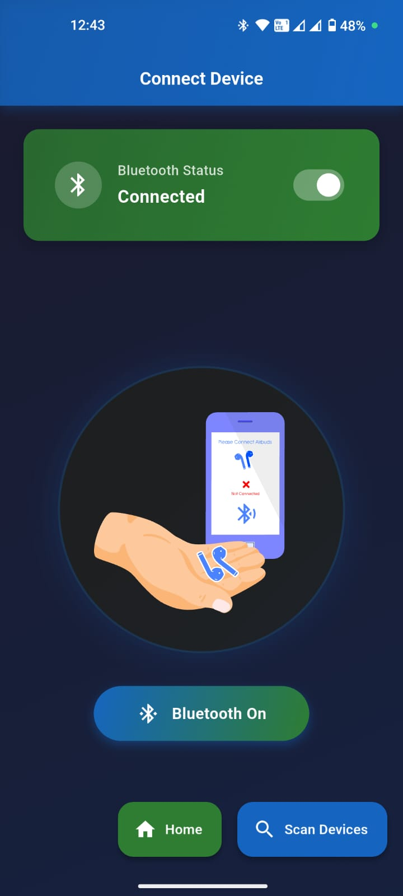
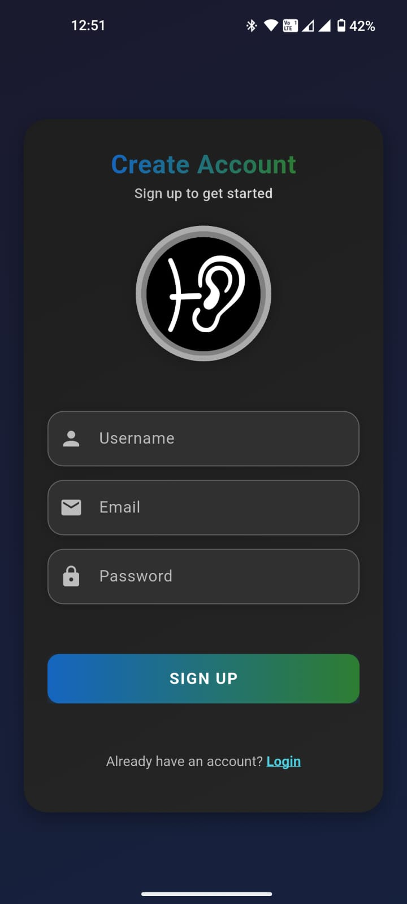
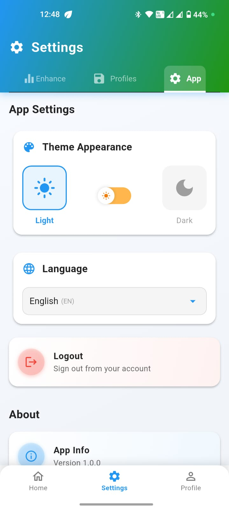
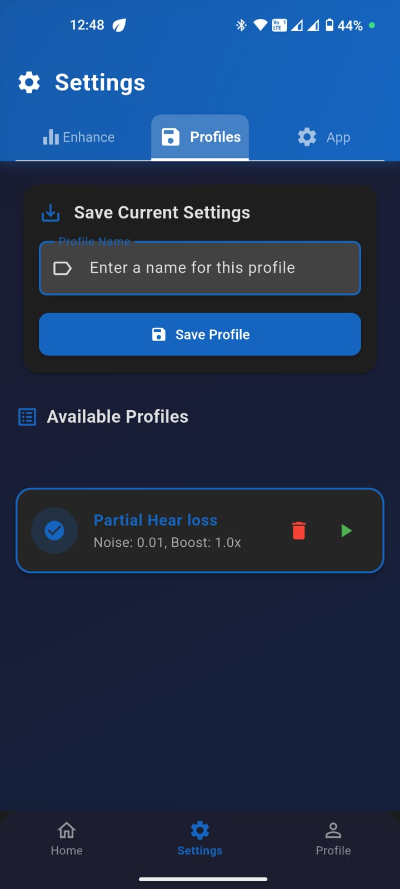
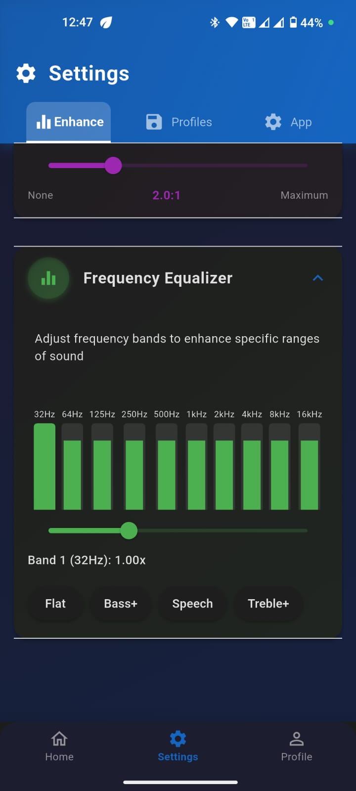
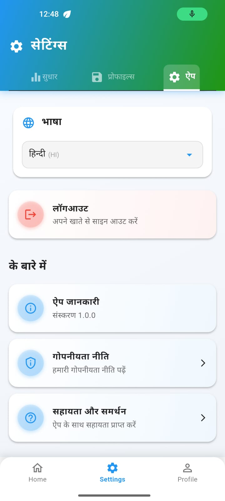

<p align="center">
  
</p>

<h1 align="center">HearWell</h1>
<p align="center">Empowering Hearing Support Through AI & Accessibility</p>

<p align="center">
  
  
  
  
</p>

<p align="center">
  <a href="https://hear-well.vercel.app/" target="_blank">
    
  </a>
  <a href="https://youtu.be/hcV_9TJoPCE" target="_blank">
    
  </a>
</p>


<h2 id="table-of-contents">📚 Table of Contents</h2>

<details open="open">
  <summary>Table of Contents</summary>
  <ul>
    <li>🌟 <a href="#about-the-project">About The Project</a></li>
    <li>🔍 <a href="#the-problem">The Problem</a></li>
    <li>💡 <a href="#our-solution">Our Solution</a></li>
    <li>📱 <a href="#features">Features</a></li>
    <li>🛠️ <a href="#technology-stack">Technology Stack</a></li>
    <li>📸 <a href="#screenshots">Screenshots</a></li>
    <li>🏁 <a href="#getting-started">Getting Started</a></li>
    <li>👥 <a href="#team">Our Team</a></li>
    <li>🤝 <a href="#contributing">Contributing</a></li>
  </ul>
</details>


<h2 id="about-the-project">🌟 About The Project</h2>

<p align="justify">
HearWell is a mobile application that transforms ordinary Bluetooth headphones into intelligent hearing assistive tools. Our mission is to make hearing support accessible, affordable, and available to anyone with a smartphone, especially in areas with limited access to healthcare and audiologists.
</p>

<p align="center">
  <em>"Bringing affordable hearing assistance to 1.5+ billion people worldwide"</em>
</p>

<p align="justify">
This project was developed for the Google Solution Challenge 2024, addressing UN Sustainable Development Goal 3: Good Health and Well-Being, with a focus on increasing access to healthcare in underserved communities.
</p>


<h2 id="the-problem">🔍 The Problem</h2>

<p align="justify">
According to the World Health Organization (WHO), over <strong>1.5 billion people</strong> experience some degree of hearing loss worldwide. However:
</p>

<ul>
  <li>Traditional hearing aids cost between <strong>$1,000-$6,000</strong>, making them inaccessible to many people</li>
  <li>Access to audiologists and hearing specialists is limited, especially in rural and low-income areas</li>
  <li>Many people who could benefit from hearing assistance go without it due to these barriers</li>
  <li>Untreated hearing loss leads to social isolation, decreased quality of life, and cognitive decline</li>
</ul>

<p align="justify">
This problem reflects a broader healthcare gap: limited access to essential services in underserved communities, leading to preventable health issues, social exclusion, and reduced quality of life.
</p>


<h2 id="our-solution">💡 Our Solution</h2>

<p align="justify">
HearWell transforms conventional Bluetooth headphones into assistive hearing devices through advanced audio processing algorithms and artificial intelligence. Unlike traditional hearing aids that can cost thousands of dollars, our solution works with equipment many people already own – a smartphone and Bluetooth headphones.
</p>

<!-- <p align="center">
  
</p> -->

<h3>What Sets Us Apart?</h3>

<table>
  <tr>
    <td>
      <strong>💰 Affordability</strong>
      <p>Works with existing devices, eliminating the need for expensive specialized hardware</p>
    </td>
    <td>
      <strong>🌐 Accessibility</strong>
      <p>Available to anyone with a smartphone and Bluetooth headphones</p>
    </td>
  </tr>
  <tr>
    <td>
      <strong>🧠 AI-Powered</strong>
      <p>Uses advanced algorithms for superior sound enhancement and clarity</p>
    </td>
    <td>
      <strong>🛠️ Multi-feature</strong>
      <p>Combines multiple hearing assistance tools in one application</p>
    </td>
  </tr>
</table>


<h2 id="features">📱 Features</h2>

<h3>Current Features</h3>

<ul>
  <li>
    <strong>AI-Powered Sound Enhancement:</strong> 
    On-device audio processing to clarify speech and suppress ambient noise
  </li>
  <li>
    <strong>Real-Time Noise Reduction:</strong> 
    Frequency filtering and gain control algorithms to improve sound clarity
  </li>
  <li>
    <strong>Live Speech-to-Text:</strong> 
    Real-time transcription powered by Google Cloud Speech-to-Text APIs
  </li>
  <li>
    <strong>Sound Classification & Alerts:</strong> 
    Differentiation between important sounds like sirens, horns, and different voice types
  </li>
  <li>
    <strong>Adaptive Sound Profiles:</strong> 
    Custom sound settings for different environments (home, office, outdoors)
  </li>
  <li>
    <strong>Multi-Language UI Support:</strong> 
    Interface available in multiple languages for global accessibility
  </li>
  <li>
    <strong>Background Processing:</strong>
    Continuous audio enhancement even when the app is running in the background
  </li>
</ul>

<h3>Planned Features</h3>

<ul>
  <li>
    <strong>Multi-Language Live Translation:</strong> 
    Real-time translation of conversations across language barriers
  </li>
  <li>
    <strong>Conversation Summarization:</strong> 
    AI-driven summaries of conversations with key takeaways
  </li>
  <li>
    <strong>Personalized Hearing Enhancement:</strong> 
    Adaptive AI that learns user preferences over time
  </li>
  <li>
    <strong>Context-Aware Audio Adjustments:</strong> 
    Smart detection of surroundings to optimize audio settings
  </li>
  <li>
    <strong>Voice Command Integration:</strong> 
    Hands-free control using natural voice commands
  </li>
  <li>
    <strong>Augmented Reality Audio Overlay:</strong>
    Spatial audio enhancements to help users focus on specific sounds or voices
  </li>
</ul>


<h2 id="technology-stack">🛠️ Technology Stack</h2>

<div align="center">
  <table>
    <tr>
      <td align="center">
        <br>
        <strong>Flutter</strong><br>
        Cross-platform framework
      </td>
      <td align="center">
        <br>
        <strong>Speech-to-Text API</strong><br>
        Real-time transcription
      </td>
      <td align="center">
        <br>
        <strong>YAMNet</strong><br>
        Audio classification
      </td>
    </tr>
    <tr>
      <td align="center">
        <br>
        <strong>Firebase</strong><br>
        Authentication & Database
      </td>
      <td align="center">
        <br>
        <strong>TensorFlow Lite</strong><br>
        On-device ML
      </td>
      <td align="center">
        <br>
        <strong>Cloudinary</strong><br>
        Media Storage
      </td>
    </tr>
  </table>
</div>

<p align="center"><em>Built on IDX with Google's cutting-edge AI technologies</em></p>


<h2 id="screenshots">📸 Screenshots</h2>

<div align="center">
  
  
  
  
</div>

<div align="center">
  
  
  
  
</div>

<p align="center"><em>HearWell's intuitive interface makes hearing assistance accessible to all</em></p>


<h2 id="getting-started">🏁 Getting Started</h2>

<h3>Prerequisites</h3>

<ul>
  <li>Flutter SDK (3.16.0 or later)</li>
  <li>Android Studio or VS Code with Flutter extensions</li>
  <li>iOS development tools (if developing for iOS)</li>
  <li>A Firebase project</li>
  <li>Google Cloud account with Speech-to-Text API enabled</li>
</ul>

<h3>Installation</h3>

1. Clone the repository
```bash
git clone https://github.com/Mastermind-sap/hear-well.git
cd hear-well
```

2. Install dependencies
```bash
flutter pub get
```

3. Configure Firebase
   - Create a Firebase project
   - Add your Android and iOS apps to the project
   - Download and add the configuration files to your project
   - Enable Authentication and Firestore

4. Set up Google Cloud
   - Create a Google Cloud project
   - Enable the Speech-to-Text API
   - Create API credentials and add them to your project

5. Run the app
```bash
flutter run
```

<p align="center">
  <a href="https://flutter.dev/docs/get-started/install">
    
  </a>
  <a href="https://firebase.google.com/docs/flutter/setup">
    
  </a>
</p>


<h2 id="team">👥 Our Team: LeafNode</h2>

<div align="center">
  <table>
    <tr>
      <td align="center">
        <a href="https://github.com/Arunav47">
          
          <br />
          <sub><b>Arunav Borthakur</b></sub>
        </a>
      </td>
      <td align="center">
        <a href="https://github.com/Krishnam2411">
          
          <br />
          <sub><b>Krishnam Maheshwari</b></sub>
        </a>
      </td>
    </tr>
    <tr>
      <td align="center">
        <a href="https://github.com/Mastermind-sap">
          
          <br />
          <sub><b>Saptarshi Adhikari</b></sub>
        </a>
      </td>
      <td align="center">
        <a href="https://github.com/sohailkazi">
          
          <br />
          <sub><b>Sohail Kazi</b></sub>
        </a>
      </td>
    </tr>
  </table>
</div>

<p align="center"><em>A team passionate about using technology to make a positive impact on people's lives</em></p>


<h2 id="contributing">🤝 Contributing</h2>

<p align="center">
  <em>We welcome contributions from developers, designers, and healthcare professionals!</em>
</p>

Please follow these steps:

1. Fork the repository
2. Create a feature branch (`git checkout -b feature/amazing-feature`)
3. Commit your changes (`git commit -m 'Add some amazing feature'`)
4. Push to the branch (`git push origin feature/amazing-feature`)
5. Open a Pull Request

For major changes, please open an issue first to discuss what you would like to change.

<h3>Areas We Need Help With</h3>
<ul>
  <li>Improving audio processing algorithms</li>
  <li>Expanding language support</li>
  <li>User testing and accessibility improvements</li>
  <li>Documentation and tutorials</li>
</ul>

<p align="center">
  <sub>© 2025 Team LeafNode. Made with ❤️ for the Google Solution Challenge 2025.</sub>
</p>
